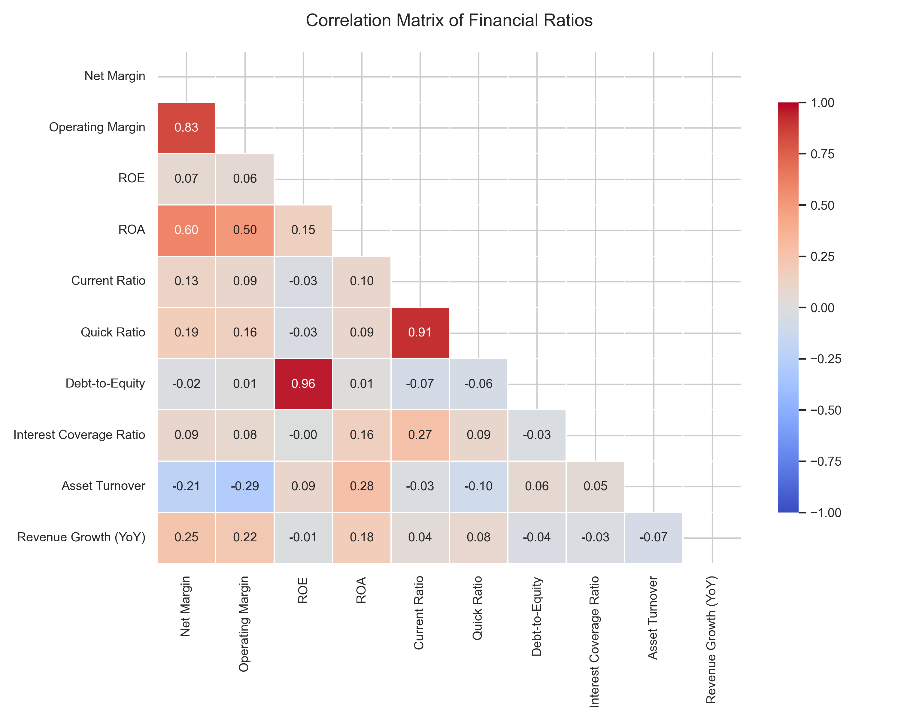

# Phase 4 — Exploratory Data Analysis (EDA) Report

This report visualizes and explains the distributions, sector-level traits, and correlations of the financial health ratios across the S&P 500.

## Correlation Heatmap Analysis

### Key Insights:
1. **ROE & Net Margin Connection:** Return on Equity (ROE) and Net Margin often have a positive correlation. When companies convert revenue to profit efficiently, it drives high returns on book value.
2. **Current & Quick Ratios:** These are highly correlated (~0.90+). For most companies, the presence of inventory doesn't structurally alter short-term liquidity profiles, but it does differentiate inventory-heavy sectors (e.g., Consumer Staples, Industrials) from services/tech.
3. **Asset Turnover & Margins:** Often negatively correlated. This is a classic business strategy trade-off:
   - *High Volume / Low Margin:* Consumer Staples and Retailers turn assets over very quickly but make low margins.
   - *Low Volume / High Margin:* Software (Technology) and Pharmaceuticals have low asset turnover but extremely high gross/operating margins.

---

## Sector Comparison (Median Values)
Below is the matrix of median ratios across GICS Sectors:

| Sector                 |   Asset Turnover |   Current Ratio | Debt-to-Equity   | Interest Coverage Ratio   | Net Margin   | Operating Margin   |   Quick Ratio | ROA    | ROE    | Revenue Growth (YoY)   |
|:-----------------------|-----------------:|----------------:|:-----------------|:--------------------------|:-------------|:-------------------|--------------:|:-------|:-------|:-----------------------|
| Communication Services |             0.55 |            1.19 | 0.84             | 4.53                      | 13.14%       | 17.63%             |          1.12 | 6.28%  | 17.84% | 3.35%                  |
| Consumer Discretionary |             0.97 |            1.34 | 1.32             | 7.33                      | 9.37%        | 15.84%             |          1.07 | 10.18% | 31.83% | 4.91%                  |
| Consumer Staples       |             0.83 |            0.95 | 1.00             | 6.58                      | 6.61%        | 14.29%             |          0.54 | 6.43%  | 17.77% | 1.73%                  |
| Energy                 |             0.5  |            1.15 | 0.49             | 8.99                      | 11.15%       | 19.24%             |          0.86 | 5.98%  | 12.92% | -0.34%                 |
| Financials             |             0.19 |            1.16 | N/A              | N/A                       | 19.33%       | 27.15%             |          1.16 | 2.48%  | 13.74% | 7.37%                  |
| Health Care            |             0.56 |            1.55 | 0.70             | 8.33                      | 12.42%       | 18.86%             |          1.19 | 6.11%  | 12.90% | 6.99%                  |
| Industrials            |             0.71 |            1.24 | 0.74             | 8.94                      | 12.41%       | 17.16%             |          1.01 | 8.27%  | 23.78% | 4.45%                  |
| Information Technology |             0.51 |            1.6  | 0.48             | 10.18                     | 16.31%       | 21.53%             |          1.37 | 7.57%  | 19.18% | 13.39%                 |
| Materials              |             0.56 |            1.68 | 0.74             | 7.37                      | 6.73%        | 13.18%             |          1.17 | 4.82%  | 11.50% | 3.30%                  |
| Real Estate            |             0.15 |            0.8  | 0.89             | 2.34                      | 21.54%       | 28.11%             |          0.8  | 3.37%  | 7.75%  | 5.06%                  |
| Utilities              |             0.19 |            0.77 | 1.74             | 2.43                      | 13.70%       | 23.03%             |          0.6  | 2.65%  | 10.45% | 9.74%                  |

### Sector Highlights:
- **Technology & Communication Services:** High net and operating margins, low leverage, and solid cash/growth profiles.
- **Utilities & Real Estate (REITs):** Characterized by high leverage (`Debt-to-Equity`) and lower liquidity (`Current Ratio`), backed by long-term stable cash flows that support debt-heavy capital structures.
- **Consumer Staples:** High `Asset Turnover` with lower margins, reflecting high volumes and tight retail/grocery markups.

---

## Outlier Analysis
The following companies occupy the extreme ends of the distribution for each ratio:

### Net Margin

**Top 3 Highest:**
1. **SPG** (Simon Property Group - Real Estate): **72.71%**
2. **VICI** (Vici Properties - Real Estate): **69.28%**
3. **CME** (CME Group - Financials): **62.45%**

**Top 3 Lowest:**
1. **MRNA** (Moderna - Health Care): **-146.83%**
2. **SATS** (EchoStar - Communication Services): **-96.62%**
3. **ARE** (Alexandria Real Estate Equities - Real Estate): **-48.54%**

---
### Operating Margin

**Top 3 Highest:**
1. **VICI** (Vici Properties - Real Estate): **91.24%**
2. **IBKR** (Interactive Brokers - Financials): **85.98%**
3. **APP** (AppLovin - Information Technology): **75.75%**

**Top 3 Lowest:**
1. **MRNA** (Moderna - Health Care): **-159.94%**
2. **LITE** (Lumentum - Information Technology): **-11.68%**
3. **IVZ** (Invesco - Financials): **-10.91%**

---
### ROE

**Top 3 Highest:**
1. **CL** (Colgate-Palmolive - Consumer Staples): **3948.15%**
2. **GDDY** (GoDaddy - Information Technology): **406.79%**
3. **VRSK** (Verisk Analytics - Industrials): **293.95%**

**Top 3 Lowest:**
1. **SATS** (EchoStar - Communication Services): **-251.43%**
2. **HAS** (Hasbro - Consumer Discretionary): **-59.87%**
3. **PSKY** (Paramount Skydance Corporation - Communication Services): **-52.94%**

---
### ROA

**Top 3 Highest:**
1. **VRSN** (Verisign - Information Technology): **62.27%**
2. **NVDA** (Nvidia - Information Technology): **58.06%**
3. **APP** (AppLovin - Information Technology): **45.92%**

**Top 3 Lowest:**
1. **SATS** (EchoStar - Communication Services): **-33.70%**
2. **MRNA** (Moderna - Health Care): **-22.87%**
3. **PSKY** (Paramount Skydance Corporation - Communication Services): **-14.28%**

---
### Current Ratio

**Top 3 Highest:**
1. **VICI** (Vici Properties - Real Estate): **26.6768**
2. **DHI** (D. R. Horton - Consumer Discretionary): **17.3940**
3. **BLK** (BlackRock - Financials): **15.7609**

**Top 3 Lowest:**
1. **MAA** (Mid-America Apartment Communities - Real Estate): **0.0902**
2. **CPT** (Camden Property Trust - Real Estate): **0.1013**
3. **EQR** (Equity Residential - Real Estate): **0.1532**

---
### Quick Ratio

**Top 3 Highest:**
1. **VICI** (Vici Properties - Real Estate): **26.6768**
2. **BLK** (BlackRock - Financials): **15.7609**
3. **IVZ** (Invesco - Financials): **12.0020**

**Top 3 Lowest:**
1. **MAA** (Mid-America Apartment Communities - Real Estate): **0.0902**
2. **CPT** (Camden Property Trust - Real Estate): **0.1013**
3. **ORLY** (O’Reilly Automotive - Consumer Discretionary): **0.1154**

---
### Debt-to-Equity

**Top 3 Highest:**
1. **CL** (Colgate-Palmolive - Consumer Staples): **158.4074**
2. **LYV** (Live Nation Entertainment - Communication Services): **38.3916**
3. **GDDY** (GoDaddy - Information Technology): **17.9572**

**Top 3 Lowest:**
1. **MPWR** (Monolithic Power Systems - Information Technology): **0.0057**
2. **INCY** (Incyte - Health Care): **0.0078**
3. **ODFL** (Old Dominion - Industrials): **0.0093**

---
### Interest Coverage Ratio

**Top 3 Highest:**
1. **PHM** (PulteGroup - Consumer Discretionary): **4923.2777**
2. **ODFL** (Old Dominion - Industrials): **4598.1250**
3. **WST** (West Pharmaceutical Services - Health Care): **1272.2000**

**Top 3 Lowest:**
1. **MRNA** (Moderna - Health Care): **-307.4000**
2. **CRWD** (CrowdStrike - Information Technology): **-10.4669**
3. **LITE** (Lumentum - Information Technology): **-8.6577**

---
### Asset Turnover

**Top 3 Highest:**
1. **MCK** (McKesson Corporation - Health Care): **4.9006**
2. **COR** (Cencora - Health Care): **4.1955**
3. **CAH** (Cardinal Health - Health Care): **4.1899**

**Top 3 Lowest:**
1. **C** (Citigroup - Financials): **0.0321**
2. **GS** (Goldman Sachs - Financials): **0.0322**
3. **CME** (CME Group - Financials): **0.0329**

---
### Revenue Growth (YoY)

**Top 3 Highest:**
1. **EXE** (Expand Energy - Energy): **188.77%**
2. **APP** (AppLovin - Information Technology): **69.99%**
3. **KEY** (KeyCorp - Financials): **65.72%**

**Top 3 Lowest:**
1. **MRNA** (Moderna - Health Care): **-39.92%**
2. **PCAR** (Paccar - Industrials): **-15.50%**
3. **ON** (ON Semiconductor - Information Technology): **-15.35%**

---

### Analysis of Notable Outliers:
- **Negative Equity Outliers:** mature companies with massive share buyback programs (like McDonald's or Domino's) have negative equity, which removes them from standard ROE/Debt-to-Equity rankings.
- **Unusually High Margins/ROA:** Asset-light software and holding firms skew profitability distributions due to zero capital requirements.
- **High Growth Outliers:** Tech/biotech firms recovering post-2022 slowdowns or companies undergoing acquisitions show extreme YoY growth numbers.

---

## Visual Distribution & Boxplots
Each ratio's distribution and GICS sector breakdown is plotted and saved under `reports/figures/`:

1. **Net Margin:** [net_margin_analysis.png](figures/net_margin_analysis.png)
2. **Operating Margin:** [operating_margin_analysis.png](figures/operating_margin_analysis.png)
3. **ROE:** [roe_analysis.png](figures/roe_analysis.png)
4. **ROA:** [roa_analysis.png](figures/roa_analysis.png)
5. **Current Ratio:** [current_ratio_analysis.png](figures/current_ratio_analysis.png)
6. **Quick Ratio:** [quick_ratio_analysis.png](figures/quick_ratio_analysis.png)
7. **Debt-to-Equity:** [debt_to_equity_analysis.png](figures/debt_to_equity_analysis.png)
8. **Interest Coverage Ratio:** [interest_coverage_ratio_analysis.png](figures/interest_coverage_ratio_analysis.png)
9. **Asset Turnover:** [asset_turnover_analysis.png](figures/asset_turnover_analysis.png)
10. **Revenue Growth (YoY):** [revenue_growth_yoy_analysis.png](figures/revenue_growth_yoy_analysis.png)
